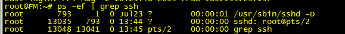
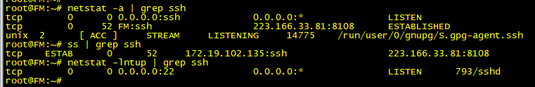
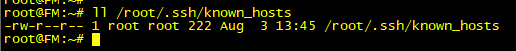
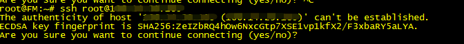
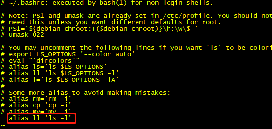

> SSH (Secure Shell)

- SSH 为建立在应用层基础上的安全协议，用于在网络主机之间进行加密的一种协议，其目的是实现安全远程登录以及其他安全网络服务
- SSH 知识点
- - SSH 是安全的加密协议，用于远程连接linux服务器
- - SSH 的默认端口是22，安全协议版本是SSH2
- - SSH 服务器主要包含2个服务功能SSH连接和SFTP服务器
- - SSH 客户端包含SSH连接命令和远程拷贝scp命令

> 对称加密

- 在对称加密中，客户端和服务器使用同一个密钥对数据进行加密和解密。这种方法的好处是加密强度高，很难破解。缺点即密钥本身容易被泄露.
  
> 非对称加密
- 在非对称加密中有两个密钥，公钥和私钥。这两个密钥配对产生和使用。用公钥加密的数据，必须用于其对应的私钥才能解开。并且，私钥无法通过公钥获取。因此，公钥是可以被公开的，而私钥必须被安全存放。
- 在SSH中，非对称加密被用来在会话初始化阶段为通信双方进行会话密钥的协商。由于非对称加密的计算开销比较大，因此一旦双方的会话密钥协商完成，后续的加密都将采用对称加密来进行。

> SSH 建立会话的过程

- 客户端发起一个TCP连接，默认端口为22
- 服务器收到连接请求后，将自己的一些关键信息发送给客户端
- - 服务器的公钥：客户端在收到这个公钥后，会在自己的"known_hosts"文件进行搜索。如果找到了相同的公钥，则说明此前连接过该服务器。如果没有找到，则会在终端上显示一段警告信息，由用户来决定是否继续连接; 
- - 服务器所支持的加密算法列表:客户端根据此列表来决定采用哪种加密算法
- 生成会话密钥。此时，客户端已经拥有了服务端的公钥，客户端和服务端需要协商一个双方都认可的密钥，并以此来对双方后续的通信内容进行加密。(采用Diffie-Hellman密钥协商算法)
- 客户端将自己的公钥id发送给服务端，服务端需要对客户端的合法性进行验证：
- - 服务端在自己的"authorized_keys"文件中搜索与客户端匹配的公钥。
- - 如果找到了，服务端用这个公钥加密一个随机数，并把加密后的结果发送给客户端
- - 如果客户端持有正确的私钥，那么它就可以对消息进行解密从而获得赠随机数
- - 客户端由这个随机数和当前的会话密钥共同生成一个MD5值
- - 客户端把MD5值发送给服务端
- - 服务端同样用会话密钥和原始的随机数计算MD5值，并与客户端发过来的值进行对比。如果相等，则验证通过
> linux 命令

- 查看sshd进程
```
ps -ef | grep ssh
```
  
- 
- 查看ssh端口
  
```
netstat -lntup | grep ssh
ss | grep ssh
netstat -a | grep ssh
netstat -lnt | grep 22   查看22端口是否开启
```
- 
  
- 查看ssh的秘钥目录
```
ll /root/.ssh/known_hosts
```
- 

- - known_hosts 中存储的是已认证的远程主机，host key，每个SSH Server都有一个secret，unique ID,called a host key.
- - 首次通过SSH登录远程主机的时候，客户端提示(yes/no),当我们选择了yes，host key 就会被加入到客户端的known_hosts中
- 

- 如果使用 ll  提示 -bash: ll: command not found
```
vi ~/.bashrc 
加入 alias ll='ls -l'
```
- 

- ssh 的配置文件
```
cat /etc/ssh/sshd_config
```

> SCP (Secure Copy)

- scp 是linux下基于ssh登录进行安全的远程文件拷贝命令

- 从远程拷贝到本地

```
scp root@ip:远程文件目录  本地文件目录
scp root@0.0.0.0:/home/test /home/
```
- 从本地拷贝到远程

```
scp /home/my_test  root@0.0.0.0:/home/
```
